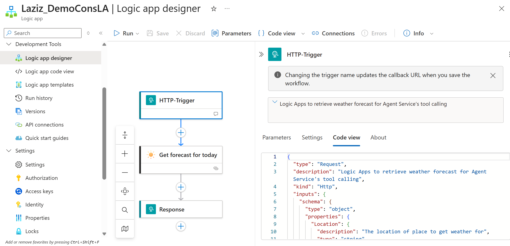

# Azure AI Foundry Agent Service: Using Logic Apps as Tools

This repository demonstrates how to integrate **Azure Logic Apps** as custom tools for an Azure AI Foundry agent.

> [!NOTE]
> For more in-depth information about the Azure AI Foundry Agent Service, refer to the official [Azure AI Foundry documentation](https://learn.microsoft.com/en-us/azure/ai-foundry/agents/overview).

***

## 📑 Table of Contents:
- [Configuring the Environment](#configuring-the-environment)
- [Option A: Logic App as a Tool using Function Calling](#option-a-logic-app-as-a-tool-using-function-calling)
- [Option B: Logic App as a Tool using OpenAPI Schema with SAS Token auth](#option-b-logic-app-as-a-tool-using-openapi-schema-with-sas-token-auth)
- [Option C: Logic App as a Tool using OpenAPI Schema with Managed Identity auth](#option-c-logic-app-as-a-tool-using-openapi-schema-with-managed-identity-auth)
- [Appendix: Sample Logic App](#appendix-sample-logic-app)

## Configuring the Environment
To run the provided Jupyter notebooks, you'll need to set up your Azure AI Foundry environment and install the required Python packages.

### 1.1 Prerequisites
You need an **Azure AI Foundry** project with a model deployment that supports function calling (e.g., GPT-4.1-mini). You also need a pre-existing Azure Logic App with an **HTTP Trigger** configured to accept incoming requests.

### 1.2 Initial Setup Authentication
The demo uses **Microsoft Entra ID** authentication via `DefaultAzureCredential` from the `azure.identity` package. To enable this, ensure you are authenticated through the Azure CLI (`az login`), by setting up environment variables for a service principal, or by using a managed identity in an Azure environment.

### 1.3 Environment Variables
Configure the following environment variables with your Azure credentials and project details:

| Environment Variable             | Description                                               |
| :------------------------------- | :-------------------------------------------------------- |
| `AZURE_FOUNDRY_PROJECT_ENDPOINT` | The endpoint URL for your Azure AI Foundry project.       |
| `AZURE_FOUNDRY_GPT_MODEL`        | The name of your model deployment.                        |
| `AZURE_SUBSCRIPTION_ID`          | Your Azure subscription ID.                               |
| `RESOURCE_GROUP_NAME`            | The name of the resource group containing your Logic App. |
| `LOGIC_APP_NAME`                 | The name of the Azure Logic App resource                  |
| `TRIGGER_NAME`                   | The name of the HTTP trigger within your Logic App        |

### 1.4 Required Libraries
Install the necessary Python packages using pip:

``` bash
pip install -r requirements.txt
```

***

## Option A: Logic App as a Tool using Function Calling
This section details how to wrap a Logic App's functionality within a Python function and expose it to the AI agent as a tool.

### 2.1 The `AzureLogicAppTool` Class
A dedicated class, `AzureLogicAppTool`, is used to manage the Logic App. It performs two key tasks:
* `register_logic_app`: This method retrieves the unique callback URL for the Logic App's HTTP-Trigger. It uses the `LogicManagementClient` to securely obtain this URL, which is required to invoke the Logic App.
* `invoke_logic_app`: This method sends a `POST` request to the registered callback URL with a JSON payload, effectively triggering the Logic App workflow.

``` Python
class AzureLogicAppTool:
    """
    A service that manages Logic Apps by retrieving their callback URLs and invoking them.
    """

    def __init__(self, subscription_id: str, resource_group: str, credential=None):
        if credential is None:
            credential = DefaultAzureCredential()
        self.subscription_id = subscription_id
        self.resource_group = resource_group
        self.logic_client = LogicManagementClient(credential, subscription_id)
        self.callback_urls: Dict[str, str] = {}

    def register_logic_app(self, logic_app_name: str, trigger_name: str) -> None:
        """
        Retrieves and stores a callback URL for a specific Logic App + trigger.
        """
        <...>

    def invoke_logic_app(self, logic_app_name: str, payload: Dict[str, Any]) -> Dict[str, Any]:
        """
        Invokes the registered Logic App with the given JSON payload.
        """
        <...>
```

### 2.2 Python Wrapper Function
A helper function, `create_weather_forecast_function`, acts as a bridge between the AI agent and the `AzureLogicAppTool`:
* Accepting a `location` parameter from the agent.
* Constructing the necessary JSON `payload`.
* Calling the `invoke_logic_app` method from the `AzureLogicAppTool` class.
* Formating the result into a standardised JSON response that the agent can easily parse.

``` Python
def create_weather_forecast_function(logic_app_tool: AzureLogicAppTool, logic_app_name: str) -> Callable[[str], str]:
    """
    Creates a weather forecast function that can be used by the AI agent.
    """
    
    def get_weather_forecast(location: str) -> str:
        """
        Gets weather forecast for a specific location using the Logic App.
        
        :param location: The location to get weather forecast for (e.g., "London", "New York", "Tokyo")
        :return: A JSON string containing the weather forecast information
        """
        payload = {"Location": location}
        
        try:
            result = logic_app_tool.invoke_logic_app(logic_app_name, payload)
            
            if result.get("result") == "success":
                weather_info = result.get("weather_data", result.get("data", "Weather data received"))
                return json.dumps({
                    "status": "success",
                    "location": location,
                    "forecast": weather_info
                })
            else:
                return json.dumps({
                    "status": "error",
                    "location": location,
                    "error": result.get("error", "Unknown error occurred")
                })
                
        except Exception as e:
            return json.dumps({
                "status": "error",
                "location": location,
                "error": str(e)
            })
    
    return get_weather_forecast
```

### 2.3 Agent Configuration
With the Python wrapper function defined, you can now configure the AI agent:
1.  **Define Agent Tools**: The `get_weather_forecast` function is added to a `FunctionTool` instance. A separate `get_current_datetime` function is also included to demonstrate the agent's ability to use multiple tools.
2.  **Enable Function Calling**: The `agents_client.enable_auto_function_calls()` method is used to instruct the agent's model to automatically call the defined tools when appropriate.
3.  **Create the Agent**: An agent is created with a clear instruction set that guides it to use the `get_weather_forecast` tool when asked about the weather.

The output of AI agent's setup may look like this:

``` JSON
Setting up agent tools...
Creating weather agent...
Created weather agent with ID: asst_P24uYTY3zZhH2VFnP6on62lt
Creating conversation thread...
Created thread with ID: thread_au3fmRys3MadIZTnCppkDHmf
Agent is ready! You can now interact with it.
```

***

## Option B: Logic App as a Tool using OpenAPI Schema with SAS Token auth
This section demonstrates how to integrate Azure Logic Apps with Azure AI Foundry agents using **OpenAPI schema**. Option B utilises _a Shared Access Signature (SAS) token_ for authentication process.

### 3.1 The `LogicAppsIntegration` Class
The `LogicAppsIntegration` class manages the integration between Logic Apps and the AI agent through OpenAPI spec. It handles:

* Callback URL Retrieval
* OpenAPI Spec Generation
* Tool Creation

``` Python
class LogicAppsIntegration:
    """
    This class uses Logic Apps callback URL as-is and creates OpenAPI tools.
    """
    
    def __init__(self, subscription_id: str, resource_group: str, credential=None):
        if credential is None:
            credential = DefaultAzureCredential()
        
        self.subscription_id = subscription_id
        self.resource_group = resource_group
        self.credential = credential
        self.logic_client = LogicManagementClient(credential, subscription_id)
    
    def get_callback_url(self, logic_app_name: str, trigger_name: str) -> str:
        """Get the actual callback URL from Logic App."""
        # Implementation retrieves secure callback URL
        
    def create_direct_openapi_spec(self, callback_url: str) -> Dict[str, Any]:
        """Create a minimal OpenAPI 3.0 spec that uses the callback URL directly."""
        # Implementation creates OpenAPI specification
        
    def create_openapi_tool(self, logic_app_name: str, trigger_name: str) -> OpenApiTool:
        """Create OpenAPI tool using direct callback URL approach."""
        # Implementation returns configured OpenApiTool
```

### 3.2 OpenAPI Specification Generation
The class automatically generates a minimal OpenAPI 3.0 spec that includes:

* Server Configuration
* Authentication
* JSON payload structure

``` Python
openapi_spec = {
    "openapi": "3.0.0",
    "info": {
        "title": "Logic App Weather API",
        "version": "1.0.0",
        "description": "Direct access to Logic App via callback URL"
    },
    "servers": [{"url": callback_url.split('?')[0]}],
    "paths": {
        "/": {
            "post": {
                "operationId": "get_weather",
                "summary": "Get weather information",
                "requestBody": {
                    "required": True,
                    "content": {
                        "application/json": {
                            "schema": {
                                "type": "object",
                                "properties": {
                                    "Location": {
                                        "type": "string",
                                        "description": "The location to get weather for"
                                    }
                                },
                                "required": ["Location"]
                            }
                        }
                    }
                }
            }
        }
    }
}
```

### 3.3 Agent Setup with OpenAPI Tools
The OpenAPI approach simplifies agent configuration by providing a standardised tool definition:

``` Python
# Initialize Logic App integration
logic_integration = LogicAppsIntegration(
    subscription_id=SUBSCRIPTION_ID,
    resource_group=RESOURCE_GROUP
)

# Create OpenAPI tool
openapi_tool, tool_name = logic_integration.create_openapi_tool(
    logic_app_name=LOGIC_APP_NAME,
    trigger_name=TRIGGER_NAME,
    tool_name="get_weather",
    tool_description="Get weather forecast for any location"
)

# Create AI Agent with OpenAPI tool
agent = agents_client.create_agent(
    model=MODEL_DEPLOYMENT,
    name="weather-agent",
    instructions="You are a helpful weather assistant. When asked about weather, use the get_weather tool with the location provided by the user.",
    tools=openapi_tool.definitions,
)
```

### 3.4 Usage Example
Once configured, the agent can seamlessly use the Logic App tool:

``` Python
# Create a conversation thread
thread = agents_client.threads.create()

# Send a message requesting weather information
message = agents_client.messages.create(
    thread_id=thread.id,
    role="user",
    content="What's the weather in London?",
)

# Process the request (agent will automatically call the Logic App)
run = agents_client.runs.create_and_process(
    thread_id=thread.id,
    agent_id=agent.id
)
```

The agent will use the OpenAPI tool to call the Logic App and provide a formatted response to the user, similar to this:

``` JSON
Displaying conversation results...
Found 2 messages
--------------------------------------------------
User: What's the weather in London?
--------------------------------------------------
Assistant: The weather in London is currently cloudy. During the day, the high temperature will be 19°C with wind speeds around 22 km/h coming from the southwest (217°). At night, it will remain cloudy with a low temperature of 17°C and winds around 20 km/h from the south-southwest (202°). The skies are overcast, and there is a chance of light rain. Ultraviolet (UV) levels are low.
--------------------------------------------------
```

> [!NOTE]
> The _OpenAPI_ approach offers improved standardisation, automatic schema validation and reduced maintenance compared to the _Function Calling_ method, while still enabling the full functionality of Logic App integration

## Option C: Logic App as a Tool using OpenAPI Schema with Managed Identity auth

This section details the most secure and robust method for integrating a Logic App by using an **OpenAPI schema** with _Managed Identity_ authentication.

> [!IMPORTANT]
> This approach enhances security by eliminating the need to manage secrets or SAS tokens. The Azure AI Foundry agent leverages the resource's managed identity to securely acquire an authentication token, which is then used to call the Logic App. _This is the recommended approach for production environments as it follows best practices for cloud security and credential management_.

### 4.1 Code Changes
The notebook for Option C is nearly identical to the one for Option B. The critical changes are within the **LogicAppsIntegration** class to enable managed identity authentication:

- **OpenAPI Specification**: The spec is modified to use an Authorization header for the managed identity's OAuth token.

``` JSON
            "components": {
                "securitySchemes": {
                    "managedIdentity": {
                        "type": "apiKey",
                        "in": "header",
                        "name": "Authorization"
                    }
                }
            }
```

- **URL Parameter Filtering**: The code filters out SAS token parameters (e.g., sig, sv) from the Logic App's callback URL, as they are replaced by the managed identity token.

``` Python
        parsed = urlparse(callback_url)
        query_params = parse_qs(parsed.query)
        
        parameters = []
        sas_params_to_exclude = {'sv', 'sig', 'sr', 'se', 'sp'}

        for param_name, param_values in query_params.items():
            if param_values and param_name not in sas_params_to_exclude:
                parameters.append({
                    "name": param_name,
                    "in": "query",
                    "required": True,
                    "schema": {
                        "type": "string",
                        "default": param_values[0]
                    }
                })
```

### 4.2 Managed Identity for the Azure AI Foundry resource
In the Azure Portal, navigate to your Azure AI Foundry resource, select the **Identity** blade and enable the system-assigned identity. Note down the _Object (principal) ID_, as you will need it in a later step.

### 4.3 Secure Logic App HTTP Trigger
Next, configure your Logic App's HTTP trigger to require a valid OAuth token from the agent.

- In the _Logic App Code view_, find your HTTP trigger definition and add the following line to [process the Authorization header](https://learn.microsoft.com/en-us/azure/logic-apps/logic-apps-securing-a-logic-app?tabs=azure-portal#include-authorization-header-in-request-or-http-webhook-trigger-outputs):
``` JSON
"operationOptions": "IncludeAuthorizationHeadersInOutputs"
```

- Switch to the _Logic App Designer_ view, open the trigger's Settings and add the following Trigger Condition. This [enforces the use of a Bearer token](https://learn.microsoft.com/en-us/azure/logic-apps/logic-apps-securing-a-logic-app?tabs=azure-portal#enable-oauth-20-with-microsoft-entra-id-as-the-only-option-to-call-a-request-endpoint-consumption-only):
``` JSON
@startsWith(triggerOutputs()?['headers']?['Authorization'], 'Bearer')
```

### 4.4 Authorisation Policy
Create a policy to grant access exclusively to your AI Foundry's **Managed Identity**.

In your Logic App, navigate to the _Authorization_ blade and click Add policy. Configure the policy by adding the following three claims to validate the incoming token:
- Issuer Claim (iss): Verifies the token is from your Microsoft Entra ID tenant.
``` JSON
Value: https://sts.windows.net/<YOUR_TENANT_ID>/
```
- Audience Claim (aud): Verifies the token is intended for Azure management APIs.
``` JSON
Value: https://management.azure.com/
```
- Object ID Claim (oid): Verifies the token belongs to your AI Project's identity.
``` JSON
Value: Use the Object (principal) ID you noted in step 4.2.
```

## Appendix: Sample Logic App
To demonstrate the integration, you'll need a Logic App with an HTTP trigger that accepts a location parameter and returns weather information.


